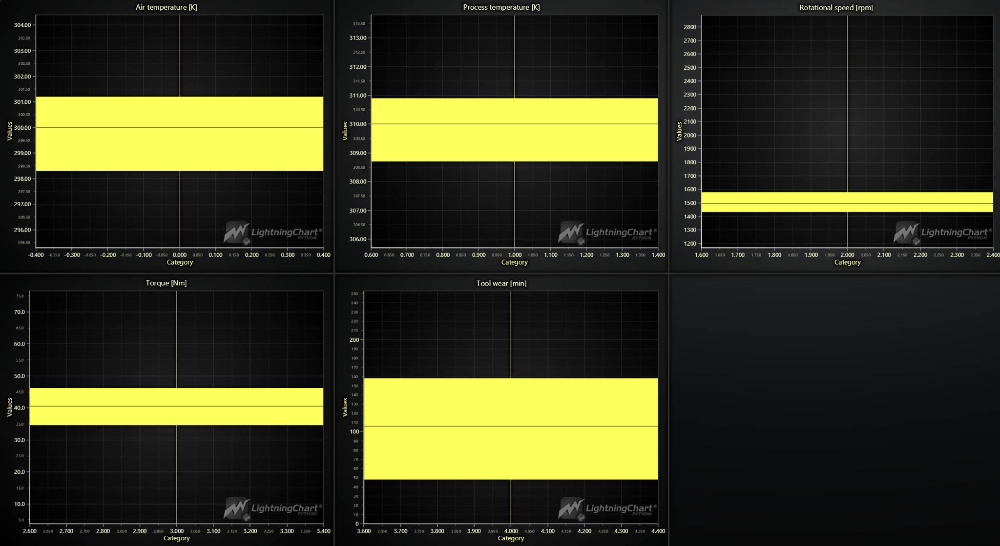
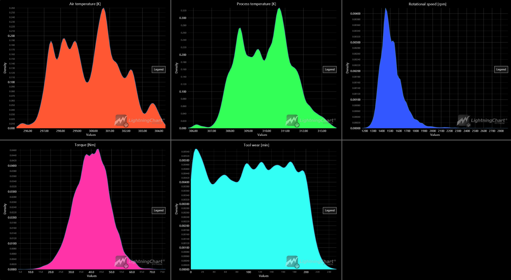
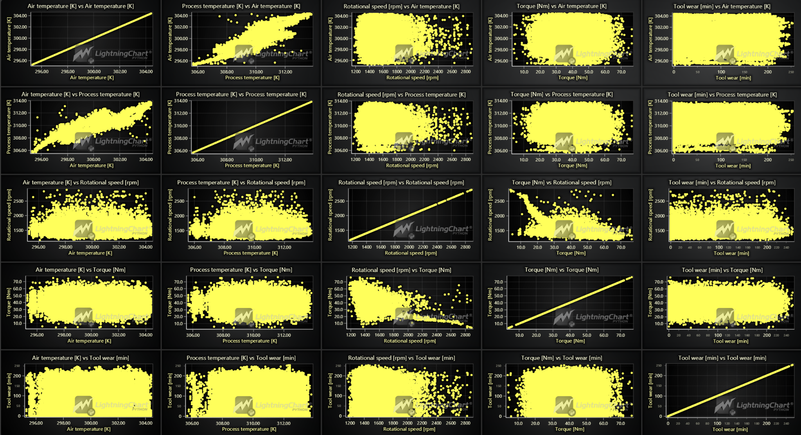
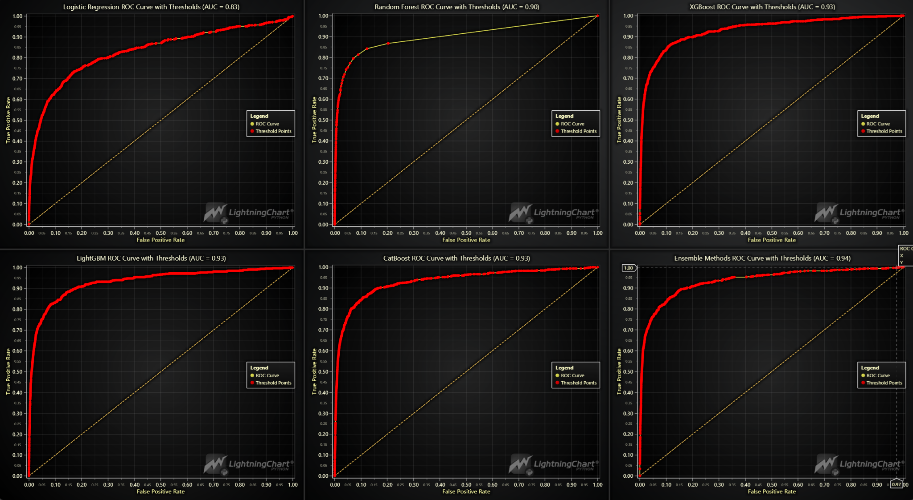
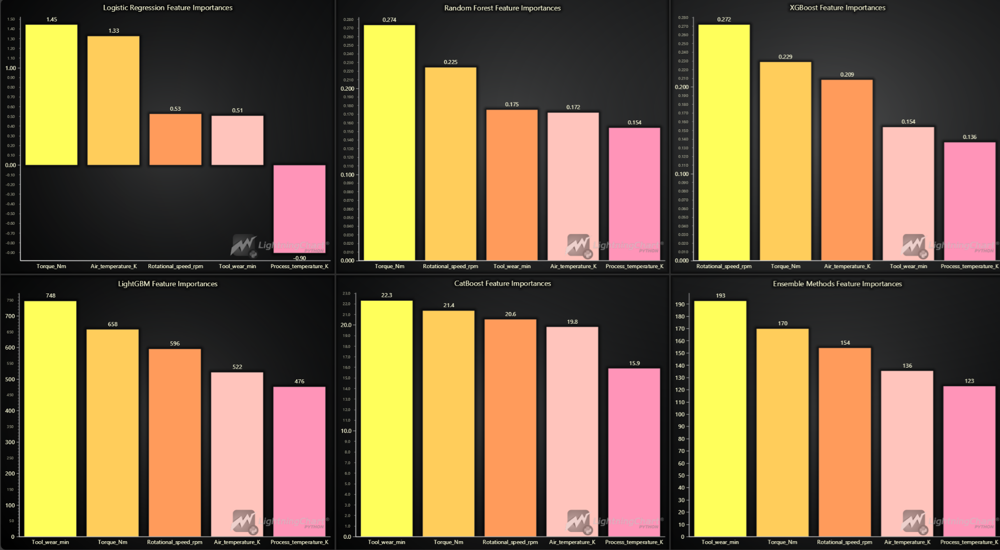
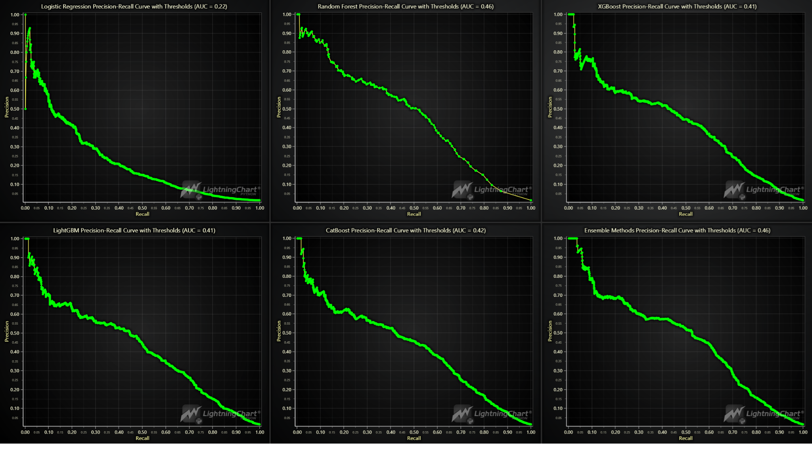
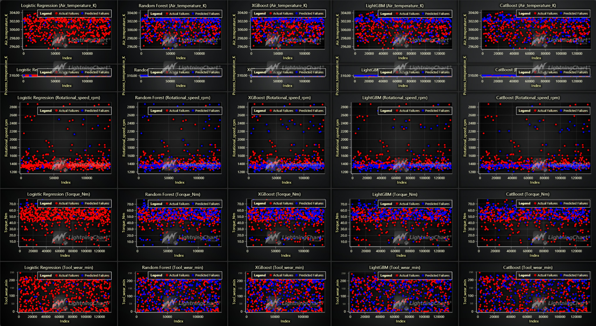

# Machinery Maintenance and Downtime Dashboard with Python

## Introduction

In the industrial sector, machinery downtime refers to periods when equipment is not operational due to failures or maintenance activities. Monitoring machinery downtime is crucial as it impacts productivity, efficiency, and profitability. Proper equipment downtime analysis helps identify the causes and patterns of downtime, leading to better maintenance strategies and reduced unplanned outages [[1](https://doi.org/10.1109/WSC.1994.717486)]. Periodic maintenance ensures that machines operate smoothly, minimizing the chances of unexpected failures [[2](https://doi.org/10.9734/jerr/2021/v20i1117413)].

## LightningChart Python

### Overview of LightningChart Python

LightningChart is a high-performance charting library designed for creating advanced data visualizations in Python. It offers a wide range of features and chart types, making it ideal for creating complex dashboards and data analysis tools. Key features include high rendering performance, a variety of chart types (e.g., line charts, heatmaps, bar charts), and extensive customization options [[3](https://lightningchart.com/python-charts/api-documentation/)].

### Features and Chart Types to be Used in the Project

In this project, we utilize LightningChart to create a dashboard for visualizing equipment downtime data. The key chart types used include box plots, density plots, bar charts, and scatter plots. These visualizations help in understanding the distribution, relationships, and importance of different operational parameters [[4](https://papers.ssrn.com/sol3/papers.cfm?abstract_id=4355849)].

- XY and Line Charts to understand the density distribution of different features, to explore relationships between multiple features, to evaluate the performance of classification models, and to analyze the trade-offs between precision and recall for different models.
- Box plots for visualizing the distribution and range of various operational parameters.
- Bar Charts to determine the most significant factors affecting machine failures.
- Scatter plots to compare actual and predicted machine failures for various features.

### Performance Characteristics

LightningChart excels in rendering large datasets quickly and efficiently. This is particularly important for real-time data visualization and for handling the extensive data typically involved in predictive maintenance applications.

## Setting Up Python Environment

### Installing Python and Necessary Libraries

To get started with predictive maintenance analysis using Python, you need to have Python installed on your system. Additionally, you'll need to install the necessary libraries, including NumPy, Pandas, LightningChart, and various machine learning libraries like Scikit-learn.

### Overview of Libraries Used

- **NumPy**: Used for numerical operations and handling arrays.
- **Pandas**: Provides data structures and data analysis tools.
- **LightningChart**: For creating high-performance data visualizations.
- **XGBoost, LightGBM, CatBoost**: For advanced machine learning algorithms.
- **Scikit-learn**: For implementing machine learning models.

### Setting Up Your Development Environment

1. Set up your development environment by creating a virtual environment and installing the necessary libraries. This ensures that your project dependencies are isolated and manageable.
2. Using Visual Studio Code (VSCode): VSCode is a popular code editor that offers a rich set of features to enhance your development workflow.

## Loading and Processing Data

### How to Load the Data Files

The data file used in this project is `X_train.csv`, which comprises observations of machine operations, each detailing various operating attributes. These attributes include Rotational Speed (rpm), Torque (Nm), Tool Wear (min), and Machine Failure. The data is well-prepared with no missing or inconsistent values.

### Handling and Preprocessing the Data

Separate the features and target variable, handle missing values if any, and scale the numerical features using StandardScaler.

## Visualizing Data with LightningChart

### Introduction to LightningChart for Python

LightningChart for Python provides various interactive and high-performance chart types suitable for data analysis and visualization. It allows you to create detailed and informative dashboards to monitor and analyze equipment downtime and predictive maintenance.

### Creating the Charts

Here are brief example scripts and diagrams of various charts utilized in this article:

- **Box Plot**: The box plots provided a clear view of the distributions and central tendencies of operational parameters such as air temperature, process temperature, rotational speed, torque, and tool wear. These visualizations highlighted the consistency and variability in the operational parameters, which are crucial for understanding the normal operating ranges and identifying anomalies.

- **Density Diagrams**: The density diagrams offered a deeper insight into the probability distributions of the same operational parameters. The peaks and troughs in these plots revealed the most common operational conditions, aiding in the identification of typical and atypical machine behaviors. Such detailed distribution analysis is essential for developing accurate predictive models.

- **Pair Plot**: The pair plot showcased the relationships between pairs of operational parameters. These scatter plots helped identify correlations and dependencies among the features, providing a comprehensive understanding of how different operational conditions interact with each other. Such interactions are vital for building robust predictive models that can account for the complex nature of industrial machinery operations.

- **ROC Curves**: The ROC curves (Receiver Operating Characteristic curves) plot the true positive rate against the false positive rate for various threshold settings of the models. The area under the curve (AUC) indicates the model's ability to distinguish between classes. Higher AUC values signify better performance. Each subplot presents the ROC curve for a different model, including Logistic Regression, Random Forest, XGBoost, LightGBM, CatBoost, and an ensemble method.

- **Feature Importance Bar Charts**: The feature importance bar charts for various models, including Logistic Regression, Random Forest, XGBoost, LightGBM, CatBoost, and an ensemble method, underscored the significance of different features in predicting machine failures. For instance, torque and tool wear consistently emerged as crucial predictors across multiple models, suggesting that these parameters are vital indicators of potential machine failures. This insight helps prioritize which parameters should be closely monitored in a predictive maintenance system.

- **Precision-Recall Curves**: The precision-recall curves illustrate the trade-off between precision and recall for different classification models, including Logistic Regression, Random Forest, XGBoost, LightGBM, CatBoost, and an ensemble method. The curves help evaluate the performance of models, particularly for imbalanced datasets where precision and recall are more informative metrics than accuracy.

- **Scatter Plots**: The scatter plots comparing actual failures to predicted failures offered a visual assessment of the models' prediction accuracy. The alignment (or misalignment) of red (actual failures) and blue (predicted failures) points revealed the models' strengths and weaknesses. Models like the ensemble method showed a closer alignment, suggesting higher accuracy and reliability in predictions.

## Conclusion

In this article, we demonstrated the integration of visualizations and machine learning models into a Python-based maintenance dashboard that provides a powerful tool for industrial equipment downtime analysis. The application provides a comprehensive view of machine operational parameters, predicted failures, and model performance metrics. By leveraging advanced visualization techniques and machine learning algorithms, industrial operators can better monitor equipment health, predict potential failures, and optimize maintenance schedules.

The use of LightningChart Python for creating these visualizations proved highly effective, offering robust performance and customization options to meet the specific needs of industrial analytics. This project demonstrates the potential of combining advanced analytics with interactive visualizations to drive informed decision-making in industrial maintenance and operations.

### Benefits of Using LightningChart Python for Visualizing Data

- **High Performance**: LightningChart handles large datasets efficiently, ensuring smooth interactions and quick rendering.
- **Interactive Visualizations**: Create dynamic and interactive charts that provide deeper insights into the data.
- **Customizable**: Tailor the visualizations to meet specific requirements and enhance the user experience.

With this approach, businesses can reduce downtime, improve productivity, and ensure the reliability of their machinery [[5](https://lightningchart.com/python-charts/)].

## References

1. Williams, E. (1995). Downtime data-its collection, analysis, and importance. https://doi.org/10.1109/WSC.1994.717486
2. Igbokwe, N., & Godwin, H. (2021). Maintenance Performance Evaluation and Downtime Analysis of Manufacturing Equipment in a Food Manufacturing Company. Journal of Engineering Research and Reports, 100–107. https://doi.org/10.9734/jerr/2021/v20i1117413
3. LightningChart Python API Reference. (n.d.). Retrieved May 31, 2024, from https://lightningchart.com/python-charts/api-documentation/
4. Optimizing Production Efficiency: A Case Study on Machine Downtime Analysis and Implementation of Quality Control Tools and Action Plans by Achal Kandoi :: SSRN (SSRN Scholarly Paper 4355849). (n.d.). Retrieved June 11, 2024, from https://papers.ssrn.com/sol3/papers.cfm?abstract_id=4355849
5. LightningChart® Python charts for data visualization. (2024, March 7). https://lightningchart.com/python-charts/
